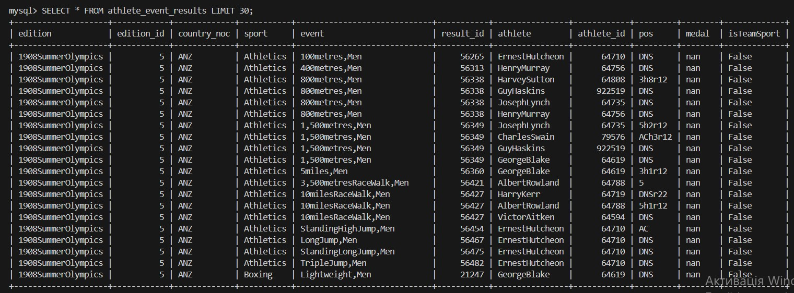
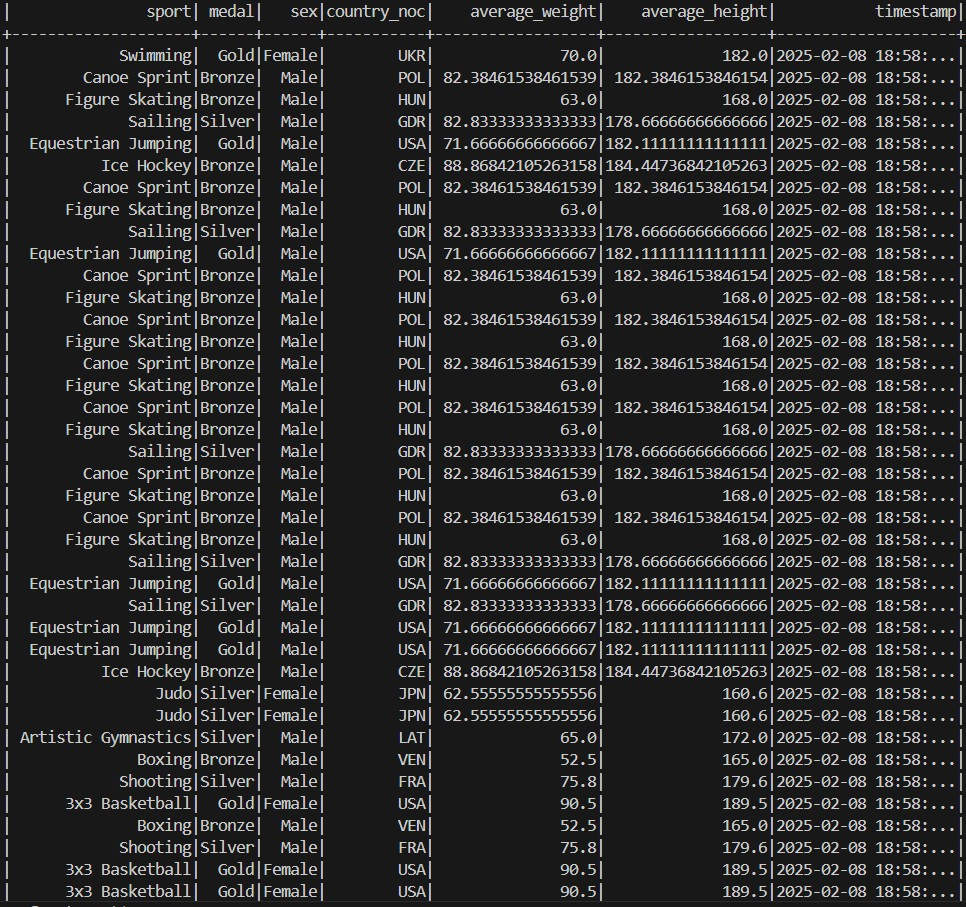

# goit-de-fp

## Для роботи з task_1

pip install -r requirements.txt

1 Оновлення системи

sudo apt update
sudo apt upgrade

python3 -m venv venv

source venv/bin/activate

2 Встановлення Apache Spark

- wget https://archive.apache.org/dist/spark/spark-3.5.1/spark-3.5.1-bin-hadoop3.tgz

- Розпакуйте архів
  tar -xvzf spark-3.5.1-bin-hadoop3.tgz

- Перемістіть Spark у /opt
  sudo mv spark-3.5.1-bin-hadoop3 /opt/spark

3 Налаштування змінних середовища
Додайте Spark до вашого PATH. Відкрийте файл ~/.bashrc у текстовому редакторі

nano ~/.bashrc

Додайте наступні рядки в кінець файлу

export SPARK_HOME=/opt/spark
export PATH=$PATH:$SPARK_HOME/bin

Таким образом, последовательность действий будет следующей:

Нажмите Ctrl + O для сохранения.
Нажмите Enter для подтверждения имени файла.
Нажмите Ctrl + X для выхода из редактора.
После этого вы сможете выполнить команду source ~/.bashrc в терминале.

Застосуйте зміни

source ~/.bashrc

4 Встановлення PySpark

pip3 install pyspark

5 Встановлення MySQL

sudo apt install mysql-server

Перевірте, чи MySQL встановлений і запущений

sudo service mysql status

Якщо потрібно, запустіть його

sudo service mysql start

6 Встановлення Kafka

source venv/bin/activate

- Завантажте Kafka (перевірте наявність останньої версії на офіційному сайті)
  wget https://archive.apache.org/dist/kafka/3.5.2/kafka_2.12-3.5.2.tgz

- Розпакуйте архів
  tar -xvzf kafka_2.12-3.5.2.tgz

- Перемістіть Kafka у /opt
  sudo mv kafka_2.12-3.5.2 /opt/kafka

7 Налаштування Kafka
Додайте Kafka до вашого PATH. Відкрийте файл ~/.bashrc у текстовому редакторі

nano ~/.bashrc

Додайте наступні рядки в кінець файлу

export KAFKA_HOME=/opt/kafka
export PATH=$PATH:$KAFKA_HOME/bin

Застосуйте зміни

source ~/.bashrc

Завантажте JAR-файли в

cd /mnt/c/Users/user/Documents/GitHub/goit-de-fp/task_1

wget https://repo1.maven.org/maven2/org/apache/spark/spark-sql-kafka-0-10_2.12/3.5.1/spark-sql-kafka-0-10_2.12-3.5.1.jar
wget https://repo1.maven.org/maven2/org/apache/kafka/kafka-clients/3.5.2/kafka-clients-3.5.2.jar

8 Запуск MySQL, Kafka та Zookeeper

Запустіть MySQL

sudo service mysql start

Підключіться до MySQL

mysql -h 217.61.57.46 -u neo_data_admin -p

ввести пароль Proyahaxuqithab9oplp

Запустіть Zookeeper (необхідний для Kafka)

source venv/bin/activate
zookeeper-server-start.sh $KAFKA_HOME/config/zookeeper.properties

В іншому терміналі запустіть Kafka

source venv/bin/activate
kafka-server-start.sh $KAFKA_HOME/config/server.properties

9 Створення Kafka-топіка

source venv/bin/activate
kafka-topics.sh --create --topic athlete_event_results --bootstrap-server localhost:9092 --partitions 1 --replication-factor 1

Перевірка що Kafka-топік створено
kafka-topics.sh --list --bootstrap-server localhost:9092

10 Встановлення MySQL Connector для Python

source venv/bin/activate
pip3 install mysql-connector-python

11 Запуск Spark коду

Перевірте версію Spark
spark-shell --version
Переконайтеся, що він може працювати
pyspark

http://localhost:9092

Потім запускайте код

cd /mnt/c/Users/user/Documents/GitHub/goit-de-fp/task_1

spark-submit --master local[4] \
--packages org.apache.spark:spark-sql-kafka-0-10_2.12:3.5.1 \
task_1.py

12 Перевірка результатів

source venv/bin/activate

kafka-console-consumer.sh --bootstrap-server localhost:9092 --topic athlete_event_results --from-beginning

Завершіть роботу
bin/kafka-server-stop.sh
13 Після виконання всіх операцій потрібно деактивувати віртуальне середовище Python

deactivate

Результат

## Для ругого завдання task_2 встановити

pip3 install apache-airflow
pip install requests

Далі додати 4 файли у свою папку [на Airflow DAG](https://github.com/goitacademy/airflow_sandbox)

python3 -m venv myenv

source myenv/bin/activate

pip install pyspark requests apache-airflow

Запуск скриптів та читання файлів

cd task_2

Скрипт

python landing_to_bronze.py

Прочитання таблиць bronze

python read_file_bronze.py

Скрипт

python bronze_to_silver.py

Прочитання таблиць silver

python read_file_silver.py

Скрипт

python silver_to_gold.py

Прочитання таблиць gold

python record_file_gold.py

Після виконання кожного з цих скриптів перевірте, чи були створені відповідні папки (bronze/, silver/, gold/) і чи містять вони Parquet файли. Ви можете використовувати Spark для читання цих файлів і перевірки їх вмісту

Запуск DAG в Airflow

source myenv/bin/activate

Ініціалізація та запуск Airflow
Ініціалізуй базу даних

airflow db migrate

AIRFLOW_CONFIG=~/airflow/airflow.cfg airflow db init

Запусти Scheduler та Webserver

airflow scheduler
airflow webserver --port 8080

Перевір, чи працює DAG

airflow dags list
airflow dags trigger data_lake_dag_kv
airflow dags list-runs -d data_lake_dag_kv
